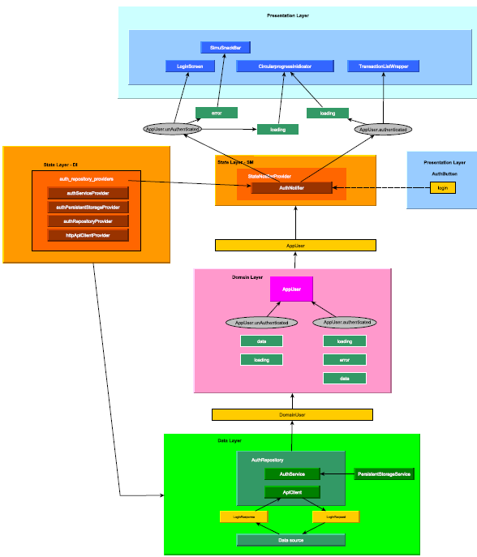

# Private Banking Mobile App (Interview Build) — Flutter

> **Context:** The code snippets in this public repository were produced as part of a **senior Flutter developer** interview for a **Swiss private banking** company. The take‑home test included **~200 upfront evaluation criteria** across three core features—**Login**, **Transactional History**, and **Encryption**—and required adherence to a predefined **Figma** design system.

---

## 🧭 Overview
- **Goal:** Demonstrate enterprise‑grade Flutter engineering under rigorous evaluation.
- **Scope:** Implement key banking flows (auth, transactions, secure storage/crypto) with production‑minded patterns and UX aligned to Figma.
- **Approach:** A **4‑layer, feature‑based** architecture with **immutable DTOs** and strict separation of concerns.

---

## 🏗 Architecture
User endpoint overview:

---

## ▶️ Demo Video
<!-- Use an HTML anchor so GitHub opens in a new tab. Add autoplay params if your host supports it (e.g., YouTube: ?autoplay=1). -->
<a href="https://drive.google.com/file/d/1XC48CXnuiubVp6exmWFtAKPpTrdmvzyL/view?usp=sharing" target="_blank" rel="noopener noreferrer"><strong>Watch the demo</strong></a>

---

## 📬 Contact
For **full code access** and the **Clockify report**, or to discuss production hardening, please reach out via email/LinkedIn.
